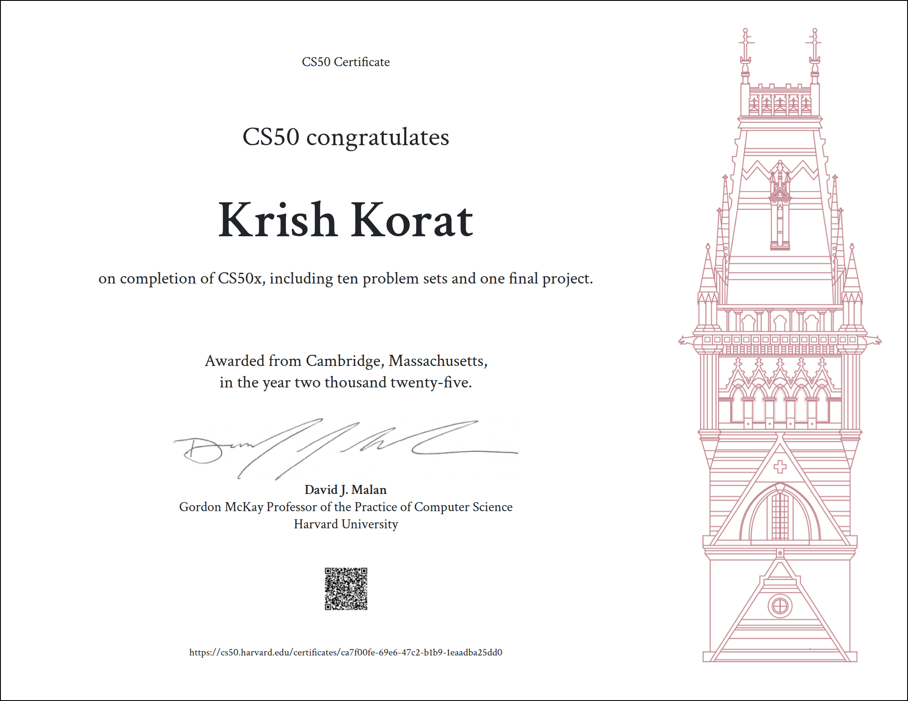

# CS50x 2025

This repository contains solutions for Harvard's CS50x 2025 course.

## Contents

- Lecture 0: Scratch
- Lecture 1: C
- Lecture 2: Arrays
- Lecture 3: Algorithms
- Lecture 4: Memory
- Lecture 5: Data Structures
- Lecture 6: Python
- Lecture 7: SQL
- Lecture 8: HTML, CSS, JavaScript
- Lecture 9: Flask
- Project: Final Project (BookShelf)

## Certificate

