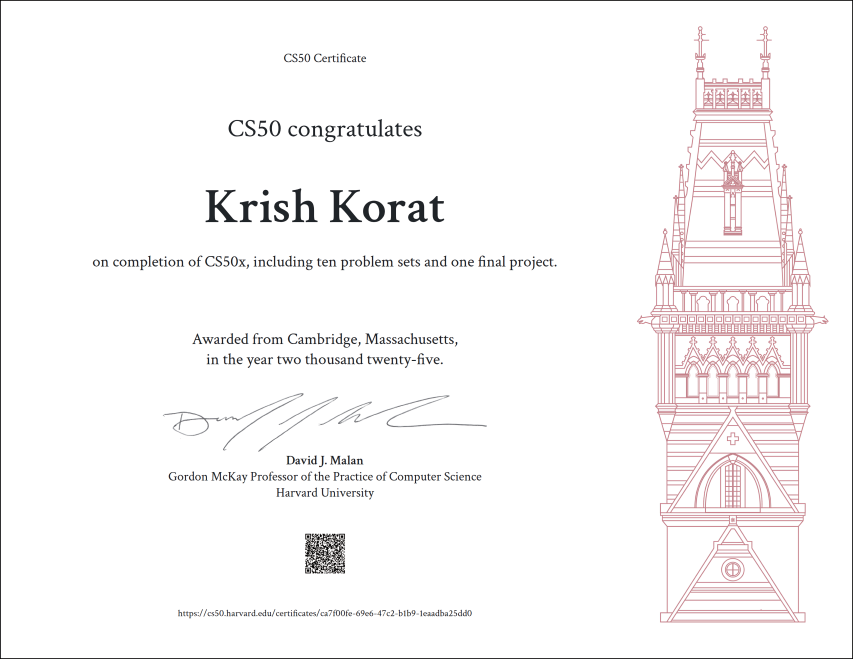

---

# CS50x 2025 Solutions

This repository contains my personal solutions, notes, and exercises completed during Harvard University’s CS50x 2025 program. CS50x is an introduction to computer science covering foundational concepts including algorithms, data structures, low-level programming, web development, and more.

## Certificate

## Course Topics Covered

* Lecture 0: Scratch
* Lecture 1: C
* Lecture 2: Arrays
* Lecture 3: Algorithms
* Lecture 4: Memory
* Lecture 5: Data Structures
* Lecture 6: Python
* Lecture 7: SQL
* Lecture 8: HTML, CSS, JavaScript
* Lecture 9: Flask

## Final Project

* BookShelf (Final Project)

## Notes

* These solutions reflect my own work throughout the course.
* Problem sets, labs, and project submissions follow CS50 academic honesty guidelines.

## Reference

Official Course Website: [https://cs50.harvard.edu/x/2025](https://cs50.harvard.edu/x/2025)

---
